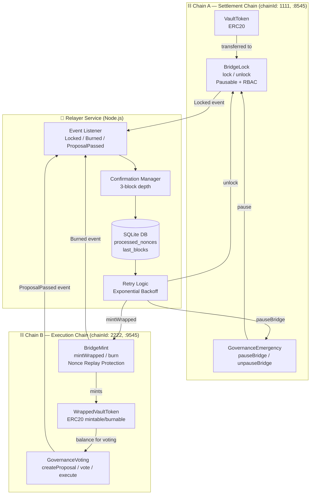
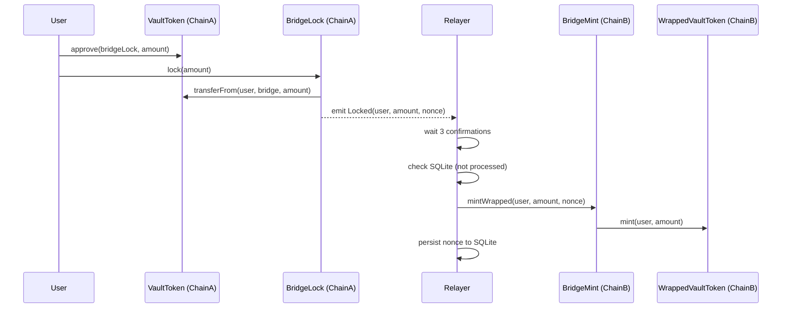
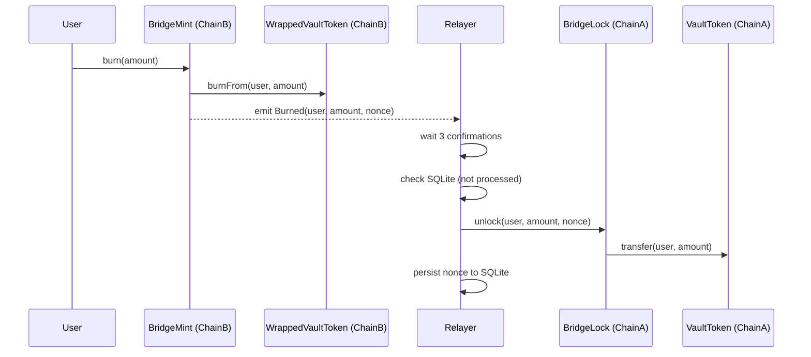
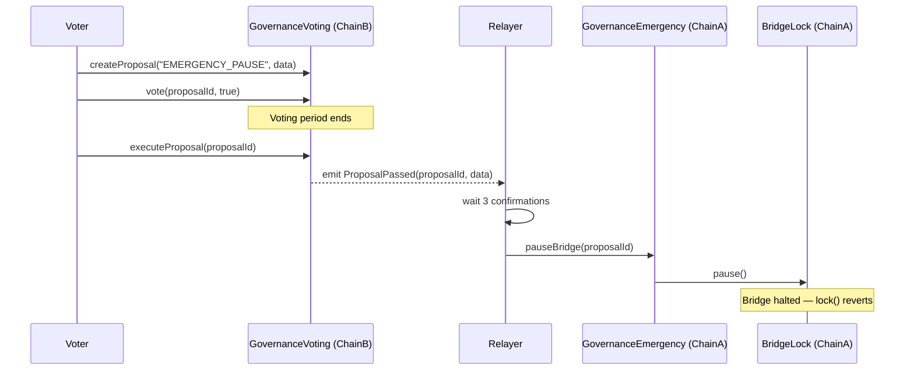
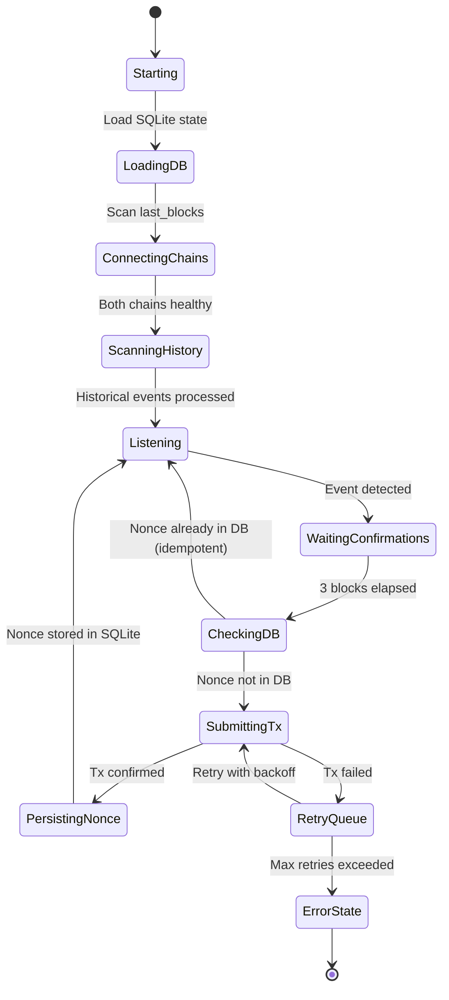
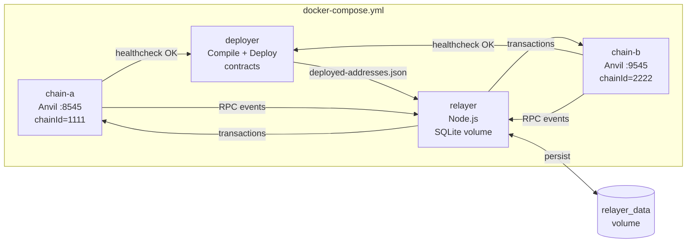
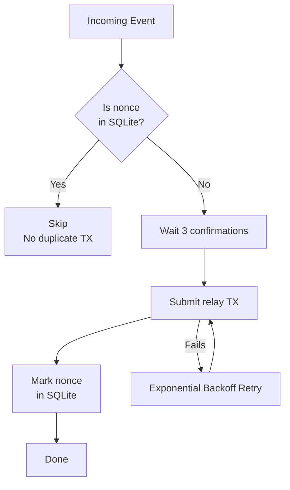

# Omnichain Asset Bridge — Architecture

This document provides a visual reference for the system architecture.

## System Architecture

## Token Flow — Lock & Mint

## Token Flow — Burn & Unlock

## Governance Flow — Cross-Chain Emergency Pause

## Relayer State Machine

## Docker Deployment

## Replay Protection Architecture

